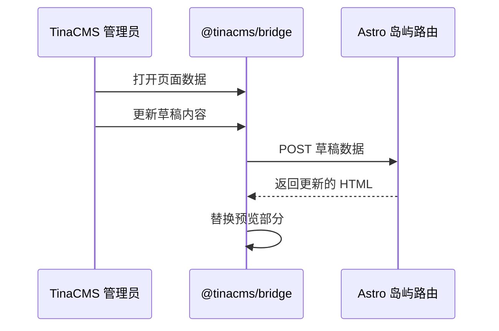

---
seo:
  title: Astro 正成为 TinaCMS 的默认入门项目 | TinaCMS 博客
  description: '在最新的无 React 可视化编辑路径在实际项目中有更多时间后，Astro 正成为 TinaCMS 的默认入门项目。'
  canonicalUrl: 'https://tina.io/blog/astro-is-the-default-tinacms-starter'
  ogImage: /img/og/astro-default-starter.png
title: Astro 正成为 TinaCMS 的默认入门项目
date: '2026-05-27T00:00:00.000Z'
last_edited: '2026-05-27T00:00:00.000Z'
author: Matt Wicks
prev: content/blog-zh/customblog_tinacmsai.mdx
next: ''
---

我们计划将 **Astro** 设为 TinaCMS 的默认入门项目。

**简而言之：** Next.js 入门项目不会消失。最新的 Astro 入门项目已经使用了无 React 的可视化编辑，一旦这种新路径在实际项目中有更多时间，Astro 将成为默认选择。

我们尚未更改默认设置。最新的 Astro 入门项目已经可用，我们希望在将 Astro 设为新项目的主要路径之前，有更多人尝试它。

## 为什么选择 Astro？

越来越多的 TinaCMS 用户选择 Astro。入门项目的克隆数量最近超过了 Next.js 入门项目，尽管 Next.js 仍然是默认选择。我们在 Discord 和支持中也看到更多关于 Astro 的问题。这与我们的经验一致：Astro 使用简单，并且适合许多使用 TinaCMS 构建的网站，包括文档、博客、营销页面、更新日志和公司网站。


**图：GitHub 讨论中关于投资哪个框架的投票**

| 仓库 | 克隆次数 - Sprint 108 |
| --- | ---: |
| `tinacms/tina-astro-starter` | 133 |
| `tinacms/tina-self-hosted-demo` | 89 |
| `tinacms/tina-nextjs-starter` | 50 |
| `tinacms/tina-barebones-starter` | 41 |

**图：Sprint 108 期间入门项目仓库的克隆次数，一周的冲刺**

Astro 也很快。它快速生成静态输出，能够并行渲染页面，并通过其 `<Image />` 组件进行图像优化，处理格式、响应式大小和延迟加载。它也有意保持轻量。你可以在需要时使用 React、Vue 或其他 UI 框架，但不必让整个网站表现得像一个 React 应用。

这为可视化编辑提供了更好的基础。编辑者仍然可以获得实时预览。访问者只需看到页面。

在 [Sprint 108 回顾](https://youtu.be/bhjE5i0y8VY?si=FIzRQLCvnhVO8A01&t=1001) 的大约 17 分钟处有更多背景信息。

## 我们改进了什么

之前的 Astro 设置使用 React 进行实时编辑。这虽然有效，但意味着网站可能会携带仅供编辑者使用的客户端代码。

这总是感觉比需要的要重。如果编辑 UI 仅供编辑者使用，访问者不应该为此担心。

最新的 Astro 入门项目现在使用无 React 的可视化编辑。页面仍然可以构建为静态 HTML，编辑部分仍然可以在编辑者输入时更新。

对于编辑者来说，工作流程应该感觉相同。他们打开 TinaCMS，点击页面上的内容，进行更改，并在发布前预览它们。内容仍然以 Markdown 或 MDX 的形式存在于你的仓库中，每次保存的更改仍然可以成为一个 Git 提交。

主要的变化在幕后。当编辑者打开 TinaCMS 时，页面上的可编辑区域与编辑器连接。当编辑者输入时，Astro 仅重新渲染编辑的部分，并将 TinaCMS 的草稿内容替换到预览中，而无需重新加载整个页面。

这适用于静态和服务器生成的页面。你的页面仍然可以按照项目需要的方式渲染。TinaCMS 只需要刷新编辑者正在更改的部分。

在公共网站上，一个小的内联检查会检测页面是否在 TinaCMS 编辑器中。如果不是，它会立即退出。

## 给我看看代码！

页面的每个可编辑部分都注册为一个岛屿。岛屿知道如何获取其内容，渲染哪个组件，以及如何将获取的数据转换为组件属性。

```ts
// src/lib/islands.ts
import type { IslandRegistry } from '@tinacms/astro/experimental';
import BlogBody from '../components/islands/BlogBody.astro';
import { getBlog } from './data';

type BlogResult = {
  data?: {
    blog?: unknown;
  };
};

export const islands: IslandRegistry = {
  blog: {
    fetch: (_request, params) => getBlog(params.get('slug') ?? ''),
    component: BlogBody,
    wrapper: { tag: 'article' },
    propsFromData: (data) => {
      const result = data as BlogResult;
      return { data: result.data?.blog };
    },
  },
};
```

一个路由处理这些岛屿的预览更新：

```ts
// src/pages/tina-island/[name].ts
import { experimental_createIslandRoute } from '@tinacms/astro/experimental';
import { islands } from '../../lib/islands';

export const prerender = false;
export const ALL = experimental_createIslandRoute(islands);
```

在页面本身，你用 `<TinaIsland>` 包裹可编辑部分。当编辑者更改内容时，TinaCMS 将草稿数据发送到岛屿路由，Astro 使用应用了草稿覆盖的更新 HTML 渲染，并将预览替换到页面中。

岛屿路由不需要为每次更新重新读取内容存储。它从 TinaCMS 通过桥发送的草稿数据中渲染，并且更新是去抖动的，因此输入不会为每个按键发送请求。

以下是相同流程的序列图：



`experimental_` 前缀是真实的。此功能在最新的 Astro 入门项目中可用，但我们仍在完善 API 并测试边缘情况，然后再将 Astro 设为默认。

## 已经在 Astro 上运行 Tina？

你不必立即迁移。现有的基于 React 的设置（`@astrojs/react`、`client:tina` 和 `useTina()`）仍然受支持和维护。

如果你想测试新设置，大多数迁移工作通常在自定义富文本组件中。任何在 `TinaMarkdown` `components` 映射中的内容可能需要从 `.tsx` 移动到 `.astro`。

其他更改较小：安装 `@tinacms/astro`，用 `<TinaIsland>` 替换 `useTina()`，并更新你的数据加载器以适应新的预览流程。

准备好后，将你的项目与 [Astro 指南](https://tina.io/docs/frameworks/astro/) 进行比较。

## 其他框架

同样的方法也可以适用于其他框架。Nuxt 或 Eleventy 适配器将遵循类似的形状：从编辑器发送草稿数据，在服务器上渲染更新的部分，然后将 HTML 替换到预览中。

我们尚未构建这些适配器，但我们乐于审查 PR。

## 接下来是什么

在 Astro 成为默认入门项目之前，我们希望有更多实际项目使用新的可视化编辑流程。

试试 Astro 入门项目：

```bash
npx create-tina-app@latest
# 选择 Astro 入门项目
```

如果你用它构建了什么，请在 [Discord](https://discord.com/invite/zumN63Ybpf) 中分享 URL。如果有什么感觉不对劲，请告诉我们。打开一个问题，发送一个 PR，或者在 Discord 中分享你的发现。