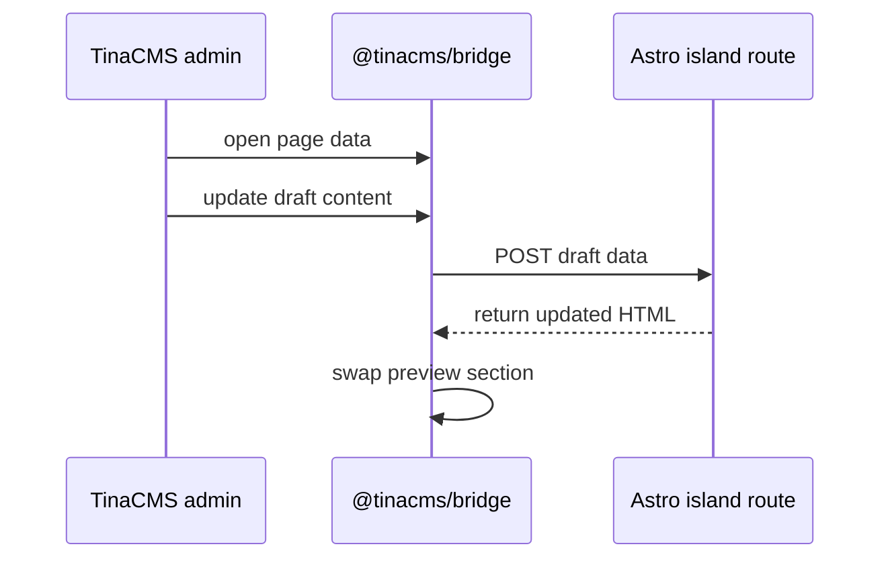

---
seo:
  title: Astro is becoming the default starter for TinaCMS | TinaCMS Blog
  description: Astro is becoming the default TinaCMS starter after the latest React-free visual editing path has had more time in real projects.
  canonicalUrl: 'https://tina.io/blog/astro-is-becoming-the-default-tinacms-starter'
  ogImage: /img/og/astro-default-starter.png
title: Astro is becoming the default starter for TinaCMS
date: '2026-05-28T00:00:00.000Z'
last_edited: '2026-05-28T00:00:00.000Z'
author: Matt Wicks
prev: content/blog/customblog_tinacmsai.mdx
next: content/blog/tinacloud-separate-content-repos.mdx
---

The latest **Astro** starter already uses React-free visual editing, and Astro will become the default once that new path has had more time in real projects.

We have not changed the default yet. [The latest Astro starter is already available](https://tina.io/roadmap), and we want more people to try it before we make Astro the main path for new projects.

***

**Heads up:** The Next.js starter is **not** going away.

> We know that the 🦙 TinaCMS community loves 🚀 Astro and we were delighted with how we could make our visual editing experience work with data islands. Given our love of fast static sites driven by markdown… It quickly became obvious that this was the best framework for the 🦙 TinaCMS community.\
> \
> — Matt Wicks, Product Owner TinaCMS

## Why Astro?

More TinaCMS users are choosing Astro. Starter clones have recently passed the Next.js starter, even though Next.js is still the default. We are also seeing [more Astro questions in Discord and support](https://github.com/tinacms/tinacms/discussions/3399). That lines up with our own experience: 

Astro is straightforward to work with, and it fits many of the sites people build with TinaCMS, including docs, blogs, marketing pages, changelogs, and company websites.


**Figure: [GitHub Discussions poll](https://github.com/tinacms/tinacms/discussions/5247) on which framework to invest in**

|                             Repo | Clones - Sprint 108 |
| -------------------------------: | ------------------- |
|     `tinacms/tina-astro-starter` | 133                 |
|  `tinacms/tina-self-hosted-demo` | 89                  |
|    `tinacms/tina-nextjs-starter` | 50                  |
| `tinacms/tina-barebones-starter` | 41                  |

**Figure: Starter repository clones during Sprint 108, a one-week sprint**

Astro is also fast. It builds static output quickly, renders pages in parallel, and includes image optimisation through its `<Image />` component, with formats, responsive sizes, and lazy loading handled for you. 

It is intentionally lightweight too. You can use React, Vue, or other UI frameworks when you need them, but you do not have to make the whole site behave like a React app.

That gives us a better foundation for visual editing. Editors still get a live preview. Visitors just get the page.

There is more background in the [Sprint 108 Review](https://youtu.be/bhjE5i0y8VY?si=FIzRQLCvnhVO8A01\&t=1001) around the 17-minute mark.

## What we've improved

The previous Astro setup used React for live editing. That worked, but it meant a site could carry client-side code for an experience only editors use.

That always felt heavier than it needed to be. If the editing UI is only for editors, visitors should not have to worry about it.

The latest Astro starter now uses React-free visual editing. Pages can still be built as static HTML, and editable sections can still update while an editor is typing.

### For editors, the workflow should feel the same

They open TinaCMS, click into content on the page, make changes, and preview them before publishing. Content still lives in your repository as Markdown or MDX, and every saved change can still become a Git commit.

The main change is behind the scenes. When an editor opens TinaCMS, editable areas on the page are connected to the editor. As the editor types, Astro re-renders just the edited section with the draft content, and TinaCMS swaps that section into the preview without reloading the whole page.

This works for both static and server-generated pages. Your page can still render the way your project needs it to. TinaCMS only needs to refresh the part the editor is changing.

On the public site, a tiny inline check detects whether the page is inside the TinaCMS editor. If it is not, it exits immediately.

## Show me the code!

Each editable part of the page is registered as an island. The island knows how to fetch its content, which component to render, and how to turn the fetched data into component props.

```ts
// src/lib/islands.ts
import type { IslandRegistry } from '@tinacms/astro/experimental';
import BlogBody from '../components/islands/BlogBody.astro';
import { getBlog } from './data';

type BlogResult = {
  data?: {
    blog?: unknown;
  };
};

export const islands: IslandRegistry = {
  blog: {
    fetch: (_request, params) => getBlog(params.get('slug') ?? ''),
    component: BlogBody,
    wrapper: { tag: 'article' },
    propsFromData: (data) => {
      const result = data as BlogResult;
      return { data: result.data?.blog };
    },
  },
};
```

One route handles the preview updates for those islands:

```ts
// src/pages/tina-island/[name].ts
import { experimental_createIslandRoute } from '@tinacms/astro/experimental';
import { islands } from '../../lib/islands';

export const prerender = false;
export const ALL = experimental_createIslandRoute(islands);
```

On the page itself, you wrap the editable section with `<TinaIsland>`. When an editor changes content, TinaCMS sends the draft data to the island route, Astro renders the updated HTML with the draft overlay applied, and the preview swaps
it into the page.

The island route does not need to read the content store again for each update. It renders from the draft data TinaCMS sends through the bridge, and updates are debounced so typing does not send a request for every keystroke.

Here is the same flow as a sequence diagram:



The `experimental_` prefix is real. This functionality is available in the
latest Astro starter, but we are still polishing the APIs and testing the edge cases before making Astro the default.

## Already running Tina on Astro?

You do not have to migrate right away. The existing React-based setup
(`@astrojs/react`, `client:tina`, and `useTina()`) is still supported and
maintained.

If you want to test the new setup, most of the migration work is usually in custom rich-text components. Anything in your `TinaMarkdown` `components` map may
need to move from `.tsx` to `.astro`.

The other changes are smaller: install `@tinacms/astro`, replace `useTina()`
with `<TinaIsland>`, and update your data loaders for the new preview flow.

When you are ready, compare your project against the [Astro guide](https://tina.io/docs/frameworks/astro/).

## Other frameworks

The same approach could work for other frameworks too. A Nuxt or Eleventy adapter would follow a similar shape: send draft data from the editor, render the updated section on the server, then swap the HTML into the preview.

We have not built those adapters yet, but we would be happy to review PRs.

## What's next

Before Astro becomes the default starter, we want more real projects using the new visual editing flow.

Try the Astro starter:

```bash
npx create-tina-app@latest
# choose the Astro starter
```

If you build something with it, share the URL in [Discord](https://discord.com/invite/zumN63Ybpf).

If something feels off, tell us. Open an issue, send a PR, or drop into Discord
with what you found.

## Related Links

Discussion - [Astro with Contextual Editing #3399](https://github.com/tinacms/tinacms/discussions/3399)

Poll - [Which frameworks do you want more investment in? #5247](https://github.com/tinacms/tinacms/discussions/5247)
