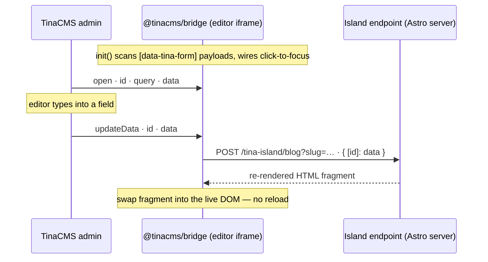

---
seo:
  title: Astro is the new default TinaCMS starter | TinaCMS Blog
  description: 'TinaCMS now ships an Astro-first starter by default — fast builds, built-in image optimisation, and visual editing with zero JavaScript shipped to visitors.'
  canonicalUrl: 'https://tina.io/blog/astro-is-the-default-tinacms-starter'
  ogImage: /img/og/astro-default-starter.png
title: Astro is the new default TinaCMS starter
date: '2026-05-27T00:00:00.000Z'
last_edited: '2026-05-27T00:00:00.000Z'
author: Matt Wicks
prev: content/blog/customblog_tinacmsai.mdx
next: ''
---

As of today, `pnpm create tina-app@latest` defaults to the Astro starter instead of Next.js. The Next.js starter is still there if you want it. We made the switch because last release we shipped a new `@tinacms/astro` integration that removes the React dependency from visual editing, so a TinaCMS site on Astro can now ship without any TinaCMS JavaScript reaching visitors.

## Why we flipped the default

GitHub clones of the Astro starter have been trending up for a while, and recently overtook clones of the Next.js one — despite the CLI defaulting to Next.js the whole time. Discord questions and support requests have been skewing Astro for months. Internally, Astro is the framework most of us actually want to work on right now.

There's more context in the [latest sprint review](https://youtu.be/bhjE5i0y8VY) if you want it.

## What you get

Astro builds are quick — static output, parallel rendering, and image optimisation built into `<Image />` (formats, responsive sizes, lazy loading) without installing anything else. `.astro` files are mostly HTML with a small templating syntax on top, so React or Vue developers find them easy to read straight away.

On the TinaCMS side: content lives in your repo as Markdown and MDX, every edit is a commit, and the visual editor lets you click a field on the rendered page to jump straight to it in the admin.

## Why live editing needs Astro's SSR

Live editing means re-rendering parts of the page as the editor types. A page that was rendered server-side with one set of data has to be rendered again with the new data — and that's a server operation. Doing it on the client would mean hydrating the page with React (or another framework) just so it can re-execute the template, which is exactly what we wanted to stop doing.

Astro's per-route SSR is the way out. The whole project can stay `output: 'static'` — every page prerendered, served from a CDN — while a single route opts into server rendering by setting `prerender = false`. The starter does exactly that: `/tina-island/[name]` runs server-side, and nothing else does.

When the editor sends unsaved data to that route, the server re-renders the affected component with the overlay data and returns the HTML fragment for the bridge to swap in. The static site stays static; only the editing path pays the SSR cost. Before this, the only way to get a live preview was to ship React and hydrate the page in the editor — which is what the old Astro setup did.

## What visitors actually load

Nothing from Tina, really. There's a small inline `<script>` on pages with editable regions that checks `window.self !== window.top` and exits immediately outside the editor iframe — a few dozen bytes, no network request. Visitors never fetch the bridge bundle.

## How an edit reaches the page



Each editable region is wrapped in a `<TinaIsland>` that emits a `data-tina-island="/tina-island/<name>?…"` attribute. The bridge POSTs the unsaved form data to that URL, the endpoint calls `readOverlay()` and renders the component server-side with the overlay applied, and the bridge swaps the response HTML in. The endpoint never reads from the content store on that path, so the flow stays stateless. Updates debounce into a single request per 300ms.

## Adding a new editable region

Every editable region the bridge can refresh is declared in `src/lib/islands.ts`. Each entry names a fetcher, the component to render, a wrapper tag, and a function that maps the fetched data into props:

```ts
// src/lib/islands.ts
import type { IslandRegistry } from '@tinacms/astro/experimental';
import BlogBody from '../components/islands/BlogBody.astro';
import { getBlog } from './data';

export const islands: IslandRegistry = {
  blog: {
    fetch: (_request, params) => getBlog(params.get('slug') ?? ''),
    component: BlogBody,
    wrapper: { tag: 'article' },
    propsFromData: (data) => ({ data: data.data?.blog }),
  },
  // ...page, global header, global footer, etc.
};
```

The route at `/tina-island/[name]` reads from that registry directly, so you don't write any route code per island:

```ts
// src/pages/tina-island/[name].ts
import { experimental_createIslandRoute } from '@tinacms/astro/experimental';
import { islands } from '../../lib/islands';
export const prerender = false;
export const ALL = experimental_createIslandRoute(islands);
```

Add an entry to `islands.ts`, reference it from a page with `<TinaIsland name="...">`, and the bridge picks it up. The `experimental_` prefix is real — these APIs may change before they stabilise.

## Already running Tina on Astro?

If you're on the React setup, you don't have to migrate. The old path (`@astrojs/react`, `client:tina`, `useTina()`) is still supported and maintained.

If you do want to move across, expect most of the work to be in your custom rich-text components — anything in your `TinaMarkdown` `components` map needs to go from `.tsx` to `.astro`. The integration changes themselves (installing `@tinacms/astro` and `@tinacms/bridge`, swapping `useTina()` for `<TinaIsland>`, wrapping data loaders in `requestWithMetadata`) are an afternoon's work.

The starter at [tina.io/docs/frameworks/astro/](https://tina.io/docs/frameworks/astro/) is the reference to diff against.

## Other frameworks

The bridge protocol is postMessage in, HTML out — it doesn't depend on Astro. A Nuxt or Eleventy adapter would follow the same pattern, but we haven't built one. We're happy to review pull requests for new framework adapters.

## Try it

```bash
pnpm create tina-app@latest
# pick "Astro" — or just hit enter, it's the default now
```

If you build something with it, share the URL in [Discord](https://discord.com/invite/zumN63Ybpf).
