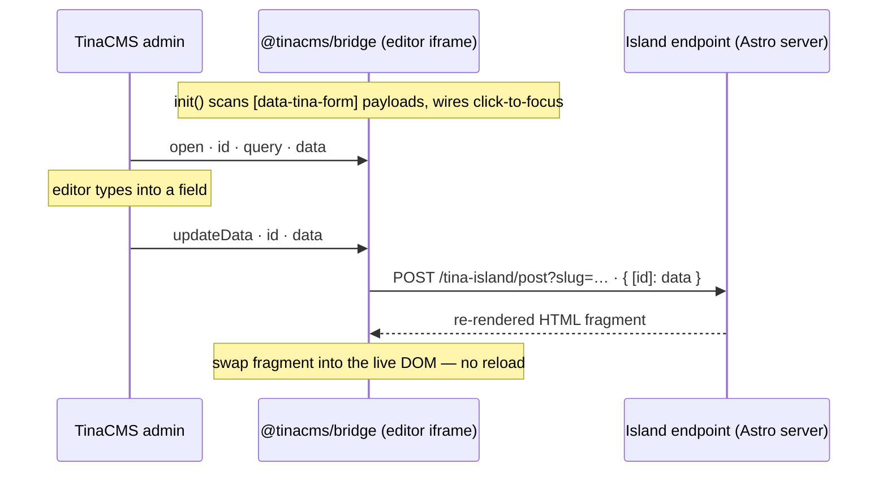

You probably reach for Astro because you don't want to ship a frontend framework to every visitor. Turning on TinaCMS visual editing used to undercut that: add `@astrojs/react`, hydrate `useTina()` inside the editor iframe, accept React in the page tree.

But not anymore.

TinaCMS visual editing on Astro now runs on a small vanilla-JS bridge which is only delivered to the editor iframe. Visitors get zero JS from Tina. Production HTML is byte-for-byte what you'd get without Tina installed. For new projects this is the new default; the [Astro starter](https://tina.io/docs/frameworks/astro/) is shipping it now.

Already on the React setup? Nothing here breaks it. `@astrojs/react`, `client:tina`, `useTina()` — still supported, still maintained. Move when you feel like it. Or don't.

## What's doing the work

Two packages.

`@tinacms/bridge` is the runtime piece: a dependency-free ESM bundle that talks the same postMessage protocol the TinaCMS admin already speaks. `init()` runs once inside the iframe, reads the `[data-tina-form]` payloads on the page, wires up click-to-focus, and forwards data changes back to the admin. There's a `refreshForms()` for view transitions, so navigating between pages inside the editor doesn't strand your form bindings.

`@tinacms/astro` is the glue. Drop `tina()` into your `astro.config.mjs` and its middleware splices the bridge script and form payloads into `<head>` — but only on edit-mode requests. Every other request gets the page untouched.

Edit mode survives in-iframe navigation through a `__tina_edit` session cookie (SameSite=Strict, and it only sets when `Sec-Fetch-Dest: iframe`). Top-level visitors can't trip it, so nothing leaks into your public pages.

## How an edit reaches the page

The bridge does a scoped soft-refresh instead:



Mark a region with `data-tina-island="<endpoint>"`. When a field changes, the bridge POSTs the current unsaved data to that endpoint, the endpoint re-renders just that component on the server, and the bridge swaps the returned HTML into the DOM.

The admin hands the bridge already-resolved data, the bridge passes it along, and the endpoint reads it with `readOverlay()` rather than going back to the content store. So the whole process is stateless.

## Wiring it into an existing project

Quickest path is the [Astro starter](https://tina.io/docs/frameworks/astro/) but retrofitting an existing site looks like this.

Install:

```bash
pnpm add @tinacms/astro tinacms
pnpm add -D @tinacms/cli
pnpm add @astrojs/node           # or vercel / netlify / cloudflare
```

No `tina/` directory yet? `pnpm tinacms init`.

Add the integration:

```ts
# astro.config.js
import { defineConfig } from 'astro/config';
import tina from '@tinacms/astro/integration';
import node from '@astrojs/node';
import mdx from '@astrojs/mdx';

export default defineConfig({
  output: 'server',
  adapter: node({ mode: 'standalone' }),
  integrations: [mdx(), tina()],
});
```

Wrap your data loaders in `requestWithMetadata`. It tags the result with the metadata `tinaField()` needs, derives the form id the bridge uses, and in edit mode quietly swaps in the unsaved overlay:

```ts
import { requestWithMetadata } from '@tinacms/astro';
import client from '../../tina/__generated__/client';

export const getPost = (slug: string) =>
  requestWithMetadata(client.queries.post({ relativePath: `${slug}.md` }));
```

Then mark up whatever should be editable:

```htmlbars
<TinaIsland name="post" wrapper={islands.post.wrapper} params={{ slug }}>
  <h1 data-tina-field={tinaField(data, 'title')}>{data.title}</h1>
  <div data-tina-field={tinaField(data, '_body')}>
    <TinaMarkdown content={data._body} />
  </div>
</TinaIsland>
```

Open `/admin/`, click into a field, make an edit, and watch the island re-render. The full walkthrough is in the getting-started guide.

## Coming from the React setup

If your site works today, leave it. This release doesn't touch the React path.

When you do want the lighter runtime, the move is mechanical:

1. drop `@astrojs/react` and the `react`/`react-dom` deps
2. swap `client:tina` + `useTina()` for `<TinaIsland>` + `data-tina-field`
3. rewrite any custom rich-text components from `.tsx` to `.astro` (AI is really good at this bit)

The `components` map you hand `TinaMarkdown` keeps the same shape; it just emits Astro now instead of React. Diff your project against the [starter](https://tina.io/docs/frameworks/astro/) and the changes show up in one pass.

## Not here yet

The bridge protocol isn't tied to Astro. There's a `postMessage` in, HTML out. Building adapters so that other frameworks (e.g. Nuxt, Hugo, and Eleventy) doable; but we haven't built them.

If that's your stack and you want to take a swing, the door's open. TinaCloud already works as-is; the stateless POST flow doesn't care what's behind the GraphQL endpoint.

Grab the [Astro starter](https://tina.io/docs/frameworks/astro/), run `pnpm dev`, and poke around `/admin/`. Same editing experience, none of the React.
