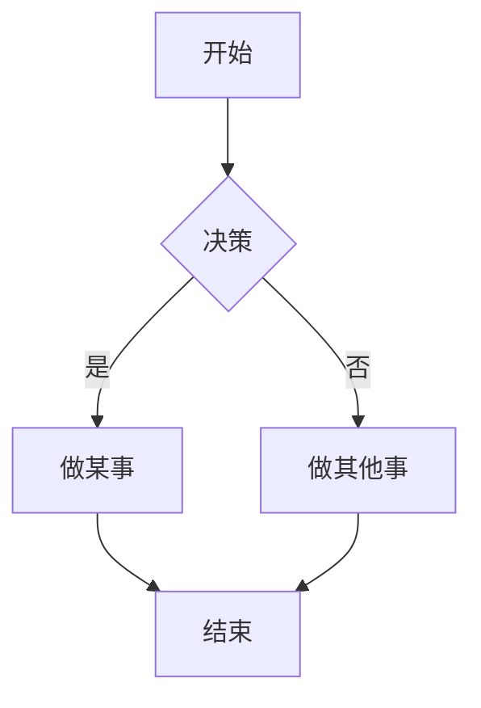

## Markdown 语法支持

虽然大多数 markdown 功能都可以直接使用，但 Tina 会忽略它无法处理的元素。我们*不*期望支持完整的 [CommonMark](https://commonmark.org/) 和 [GitHub Flavored Markdown](https://github.github.com/gfm/) 规范。请务必通过我们的[社区渠道](/community/)表达您对各种富文本功能的支持！

## 支持的元素

以下是 Markdown 语法的概述，包含您可以在 TinaCMS 或您自己的文本文件中使用的示例。

### 标题

```markdown
# 这是一个 h1 标签

## 这是一个 h2 标签

#### 这是一个 h4 标签
```


### 强调

```markdown
_这段文字将是斜体_

**这段文字将是粗体**

_您**可以**组合使用它们_

~这段文字有删除线~
```

*这段文字将是斜体*

**这段文字将是粗体**

*您**可以**组合使用它们*

~~这段文字有删除线~~

### 列表

#### 无序列表

```markdown
- 项目 1
- 项目 2
  - 项目 2a
  - 项目 2b
```

* 项目 1
* 项目 2
  * 项目 2a
  * 项目 2b

#### 有序列表

```markdown
1. 项目 1
1. 项目 2
1. 项目 3
   1. 项目 3a
   1. 项目 3b
```

1. 项目 1
2. 项目 2
3. 项目 3
   1. 项目 3a
   2. 项目 3b

### 图片

```markdown

格式: 
```


### 链接

```markdown
http://tina.io - 自动识别！
[TinaCMS](http://tina.io)
```

[http://tina.io](http://tina.io) - 自动识别！
[TinaCMS](http://tina.io)

### 引用块

```markdown
正如拿破仑对狮虎兽所说：

> 它几乎是我最喜欢的动物。
> 它像狮子和老虎的混合……为其魔法技能而繁育。
```

正如拿破仑对狮虎兽所说：

> 它几乎是我最喜欢的动物。
> 它像狮子和老虎的混合……为其魔法技能而繁育。

### 内联代码

```markdown
我认为您应该在这里使用
`<addr>` 元素。
```

我认为您应该在这里使用
`<addr>` 元素。

### 语法高亮

以下是如何使用 [GitHub Flavored Markdown](https://help.github.com/articles/basic-writing-and-formatting-syntax/) 进行语法高亮的示例：

````markdown
```javascript
function fancyAlert(arg) {
  if (arg) {
    $.facebox({ div: '#foo' })
  }
}
```
````

这是它的外观 - 带有漂亮颜色和样式的代码标题！

```javascript
function fancyAlert(arg) {
  if (arg) {
    $.facebox({ div: '#foo' })
  }
}
```

### 表格

您可以通过列出单词并用连字符 `-`（用于第一行）分隔它们，然后用竖线 `|` 分隔每一列来创建表格：

```
| 第一列标题                | 第二列标题                 |
| --------------------------- | ---------------------------- |
| 单元格 1 的内容         | 单元格 2 的内容          |
| 第一列的内容 | 第二列的内容 |
```

| 第一列标题                | 第二列标题                |
| --------------------------- | ---------------------------- |
| 单元格 1 的内容         | 单元格 2 的内容          |
| 第一列的内容 | 第二列的内容 |

### 图表

您可以使用 Mermaid 图表直接在 Markdown 中可视化流程、序列和其他图表类型。以下是一个 Mermaid 流程图的示例：



## 不支持的元素

* 脚注
* 通过缩进的代码块（请使用 ` ``` `）
* 列表项中的代码块
* 表格中的非内联元素...
* 不支持的方案的链接 – 只有以 http、https、mailto、tel 和 xref 开头的 URL 会被识别。

### 不可序列化的内容

当使用 MDX 时，TinaCMS 没有构建步骤。

这意味着任何需要执行的 JavaScript 表达式都不会生效。

* 不支持 `import`/`export`
* 不支持 JavaScript 表达式，例如...
  * `const a = 2`
  * `## 今天是 {new Date().toLocaleString()}`

## 自动转换

对于某些元素，Tina 会自动转换值：

### 粗体和斜体标记

从 `__Hello__` 到 `**Hello**`。

### 列表项

从 `- 项目 1` 到 `项目 1`。

### 深度嵌套的引用块和代码块

从 `* > 我的引用块` 到 `* 我的引用块`。

###