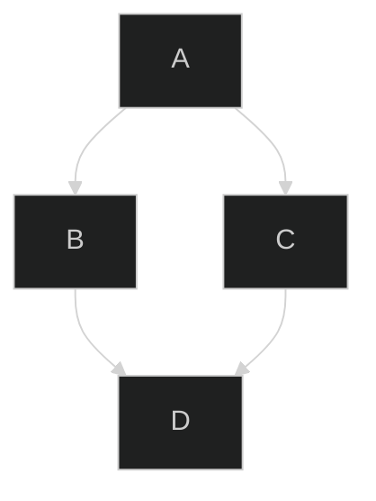

> ❕ TinaCMS 现在在版本 2.3.0+ 中支持 **MermaidJS** 图表

## 什么是 Mermaid？

Mermaid 是一种用于 Markdown 的图表定义语法。

> 更多详情，请查看 [MermaidJS 文档](https://mermaid.js.org/config/usage.html)。

使用这种简单的图形描述语言可以创建流程图、时序图、甘特图等。下面是一个基本的 Mermaid 语法示例：

````

````


## Mermaid 配置

您还可以直接在 Mermaid 代码块中传递配置选项，以控制图表的渲染方式。例如，您可以将主题设置为暗模式，如下所示：

````

````


## 编辑和预览 Mermaid 图表

插入 Mermaid 图表后，您可以在 **编辑模式**（用于修改 Mermaid 代码）和 **预览模式**（查看渲染后的图表）之间切换。

* **桌面端**：将鼠标悬停在图表上以显示编辑/预览控件。
* **移动端**：点击图表以显示编辑按钮，然后在模式之间切换。

### 语法错误处理

如果您的 Mermaid 代码中存在语法错误，图表下方会出现一个 **红色错误框**。此框显示 Mermaid 解析器报告的有用信息和错误。纠正语法后，图表将更新。


### 删除 Mermaid 图表

要删除 Mermaid 图表：

* **桌面端**：点击图表并按下键盘上的 `Delete` 键。
* **编辑时**：在代码块的开头按下 `Backspace`。

## Mermaid 包版本控制

TinaCMS 使用 **Mermaid NPM 包** 来渲染和解析 Mermaid 语法。目前，我们已将内部版本锁定为 `v9.3.0` 以确保与 CommonJS 的兼容性。

然而，在您的应用程序中安装 Mermaid 时，您可以自由使用任何版本的 Mermaid 或其他兼容的渲染包。

## 示例

### 在 React 中设置 Mermaid

要在您的 React 项目中快速开始使用 MermaidJS，请按照以下步骤操作：

#### 1. 安装 Mermaid 包

首先，使用您的包管理器安装 Mermaid 包：

```shell
pnpm install mermaid
```

#### 2. 创建一个 `MermaidElement` 组件

此组件将在您的应用程序中渲染 Mermaid 图表。使用以下代码：

```javascript
import { useRef, useEffect } from 'react';
import mermaid from 'mermaid';

export default function MermaidElement({ value }) {
  const mermaidRef = useRef(null);

  useEffect(() => {
    if (mermaidRef.current) {
      mermaid.initialize({ startOnLoad: true });
      mermaid.run();
    }
  }, []);

  return (
    <div contentEditable={false}>
      <div ref={mermaidRef}>
        <pre className="mermaid">{value}</pre>
      </div>
    </div>
  );
}

```

#### 3. 将 Mermaid 组件添加到 `<TinaMarkdown />`

将 `MermaidElement` 集成到 `<TinaMarkdown />` 组件中以处理 Mermaid 图表：

```javascript
<TinaMarkdown content={content} components={{
  mermaid({ value }) {
    return <MermaidElement value={value} />;
  }
}} />

```

#### 4. 完成！🎉

您的 React 应用现在可以渲染在 TinaCMS 编辑器中创建的 Mermaid 图表。