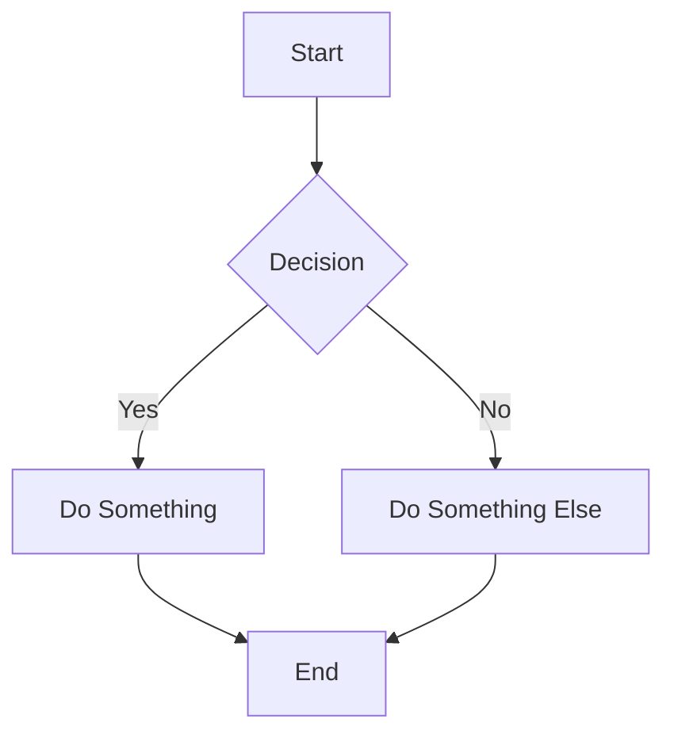

## Markdown Handling

Since markdown is an open-format Tina does its best to handle the most common syntax's, but in some scenarios Tina will ignore or automatically alter content:

### Unsupported elements

While most markdown features are supported out of the box, Tina will ignore elements that it cannot handle. We *do not* expect to support the full [CommonMark](https://commonmark.org/) and
[GitHub Flavored Markdown](https://github.github.com/gfm/) specs. Be sure to voice your support for various rich-text features by reaching out through one of our [community channels](/community/)!

* Footnotes
* Code blocks via indentation (use ` ``` ` instead)
* Strikethrough

##### Table Cell Limitations

Within table cells, support is limited to inline elements only. The following types are unsupported:

* Code Block
* Lists
* Quote
* Headings

If you try to add these types into a table cell, they will be treated as a string.**❌ Figure: Bad example - A table with block elements treated as strings**\
\
**✅ Figure: Good example - A table with inline elements**

### Automatic transforms

For some elements, Tina will automatically transform the values:

**Bold and italic marks**:

```
__Hello__
```

Will be transformed to:

```
**Hello**
```

**Line items**:

```
- Item 1
```

Will be transformed to:

```
* Item 1
```

**Deeply-nested blockquotes and code blocks**:

Some of the more complex nesting patterns you can do with markdown are not supported

```
* > My blockquote
```

Will be transformed to:

```
* My blockquote
```

## Caveats

Since markdown and MDX are traditionally handled through some sort of build
step, Tina's approach adds some constraints to make things work as expected.
[Read more](/docs/editing/markdown/) about Tina's approach to handling markdown
and MDX.

### All content must be *serializable*

When we say serializable, we mean that they must not be JavaScript expressions that would need to be executed at any point.

* No support for `import`/`export`
* No support for JavaScript expressions (eg. `const a = 2`, `console.log("Hello")`)

For example:

```md
## Today is {new Date().toLocaleString()}
```

This expression will be ignored, instead register a "Date" `template`:

```md
## Today is <Date />
```

Then you can create a `Date` component which returns `new Date().toLocaleString()` under the hood.

### Links must start with a supported scheme

When using hyperlinks in markdown within the markdown editor, ensure that the URLs begin with one of the following supported schemes:

* http
* https
* mailto
* tel
* xref

Any URLs not starting with these schemes will be ignored.

```javascript
e.g.
❌ google.com
✅ https://tina.io
```

Here's a demo of how everything looks.

The following markdown cheatsheet is adapted from: [https://guides.github.com/features/mastering-markdown/](https://guides.github.com/features/mastering-markdown/)

# What is Markdown?

Markdown is a way to style text on the web. You control the display of the document; formatting words as bold or italic, adding images, and creating lists are just a few of the things we can do with Markdown. Mostly, Markdown is just regular text with a few non-alphabetic characters thrown in, like `#` or `*`.

# Syntax guide

Here’s an overview of Markdown syntax that you can use anywhere on GitHub.com or in your own text files.

## Headers

```markdown
# This is a h1 tag

## This is a h2 tag

#### This is a h4 tag
```

# This is a h1 tag

## This is a h2 tag

#### This is a h4 tag

## Emphasis

```markdown
_This text will be italic_

**This text will be bold**

_You **can** combine them_
```

*This text will be italic*

**This text will be bold**

*You **can** combine them*

## Lists

### Unordered

```markdown
- Item 1
- Item 2
  - Item 2a
  - Item 2b
```

* Item 1
* Item 2
  * Item 2a
  * Item 2b

### Ordered

```markdown
1. Item 1
1. Item 2
1. Item 3
   1. Item 3a
   1. Item 3b
```

1. Item 1
2. Item 2
3. Item 3
   1. Item 3a
   2. Item 3b

## Images

```markdown

Format: 
```


## Links

```markdown
http://tina.io - automatic!
[TinaCMS](http://tina.io)
```

[http://tina.io](http://tina.io) - automatic!
[TinaCMS](http://tina.io)

## Blockquotes

```markdown
As Napoleon said about the liger:

> It’s pretty much my favorite animal.
> It’s like a lion and a tiger mixed… bred for its skills in magic.
```

As Napoleon said about the liger:

> It’s pretty much my favorite animal.
> It’s like a lion and a tiger mixed… bred for its skills in magic.

## Inline code

```markdown
I think you should use an
`<addr>` element here instead.
```

I think you should use an
`<addr>` element here instead.

## Syntax highlighting

Here’s an example of how you can use syntax highlighting with [GitHub Flavored Markdown](https://help.github.com/articles/basic-writing-and-formatting-syntax/):

````markdown
```js:fancyAlert.js
function fancyAlert(arg) {
  if (arg) {
    $.facebox({ div: '#foo' })
  }
}
```
````

And here's how it looks - nicely colored with styled code titles!

```js:fancyAlert.js
function fancyAlert(arg) {
  if (arg) {
    $.facebox({ div: '#foo' })
  }
}
```

## Tables

You can create tables by assembling a list of words and dividing them with hyphens `-` (for the first row), and then separating each column with a pipe `|`:

```markdown
| First Header                | Second Header                |
| --------------------------- | ---------------------------- |
| Content from cell 1         | Content from cell 2          |
| Content in the first column | Content in the second column |
```

| First Header                | Second Header                |
| --------------------------- | ---------------------------- |
| Content from cell 1         | Content from cell 2          |
| Content in the first column | Content in the second column |

## Diagrams

You can use Mermaid diagrams to visualize flows, sequences, and other chart types directly in Markdown. Here’s an example of a Mermaid flowchart:


