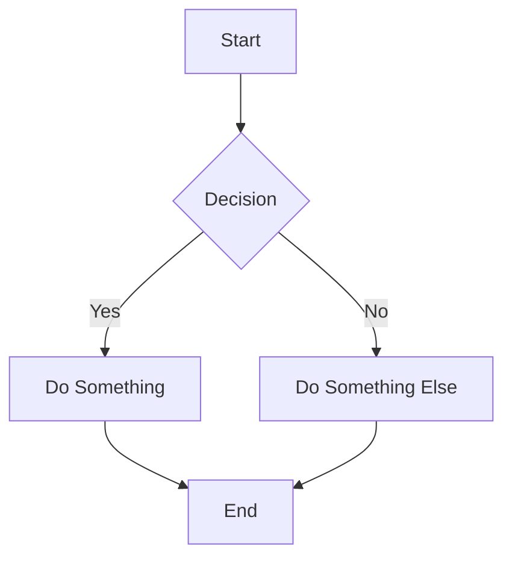

## Markdown Syntax Support

While most markdown features are supported out of the box, Tina will ignore elements that it cannot handle. We *do not* expect to support the full [CommonMark](https://commonmark.org/) and
[GitHub Flavored Markdown](https://github.github.com/gfm/) specs. Be sure to voice your support for various rich-text features by reaching out through one of our [community channels](/community/)!

## Supported Elements

Here’s an overview of Markdown syntax with examples that you can use with TinaCMS or in your own text files.

### Headers

```markdown
# This is a h1 tag

## This is a h2 tag

#### This is a h4 tag
```


### Emphasis

```markdown
_This text will be italic_

**This text will be bold**

_You **can** combine them_

~This text has a strikethrough~
```

*This text will be italic*

**This text will be bold**

*You **can** combine them*

~~This text has a strikethrough~~

### Lists

#### Unordered

```markdown
- Item 1
- Item 2
  - Item 2a
  - Item 2b
```

* Item 1
* Item 2
  * Item 2a
  * Item 2b

#### Ordered

```markdown
1. Item 1
1. Item 2
1. Item 3
   1. Item 3a
   1. Item 3b
```

1. Item 1
2. Item 2
3. Item 3
   1. Item 3a
   2. Item 3b

### Images

```markdown

Format: 
```


### Links

```markdown
http://tina.io - automatic!
[TinaCMS](http://tina.io)
```

[http://tina.io](http://tina.io) - automatic!
[TinaCMS](http://tina.io)

### Blockquotes

```markdown
As Napoleon said about the liger:

> It’s pretty much my favorite animal.
> It’s like a lion and a tiger mixed… bred for its skills in magic.
```

As Napoleon said about the liger:

> It’s pretty much my favorite animal.
> It’s like a lion and a tiger mixed… bred for its skills in magic.

### Inline code

```markdown
I think you should use an
`<addr>` element here instead.
```

I think you should use an
`<addr>` element here instead.

### Syntax highlighting

Here’s an example of how you can use syntax highlighting with [GitHub Flavored Markdown](https://help.github.com/articles/basic-writing-and-formatting-syntax/):

````markdown
```javascript
function fancyAlert(arg) {
  if (arg) {
    $.facebox({ div: '#foo' })
  }
}
```
````

And here's how it looks - nicely colored with styled code titles!

```javascript
function fancyAlert(arg) {
  if (arg) {
    $.facebox({ div: '#foo' })
  }
}
```

### Tables

You can create tables by assembling a list of words and dividing them with hyphens `-` (for the first row), and then separating each column with a pipe `|`:

```markdown
| First Header                | Second Header                |
| --------------------------- | ---------------------------- |
| Content from cell 1         | Content from cell 2          |
| Content in the first column | Content in the second column |
```

| First Header                | Second Header                |
| --------------------------- | ---------------------------- |
| Content from cell 1         | Content from cell 2          |
| Content in the first column | Content in the second column |

### Diagrams

You can use Mermaid diagrams to visualize flows, sequences, and other chart types directly in Markdown. Here’s an example of a Mermaid flowchart:



## Unsupported Elements

* Footnotes
* Code blocks via indentation (use ` ``` ` instead)
* Non-inline elements in tables...
* Links with an unsupported scheme – only URLs beginning with http, https, mailto, tel and xref will be recognised.

### Non-serializable content

TinaCMS has no build step when MDX is used.

This means that any JavaScript expressions needing execution won't take effect.

* No support for `import`/`export`
* No support for JavaScript expressions, such as...
  * `const a = 2`
  * `## Today is {new Date().toLocaleString()}`

## Automatic Transforms

For some elements, Tina will automatically transform the values:

### Bold and italic marks

From `__Hello__` to `**Hello**`.

### Line items

From `- Item 1` to `Item 1`.

### Deeply-nested blockquotes and code blocks

From `* > My blockquote` to `* My blockquote`.

###
