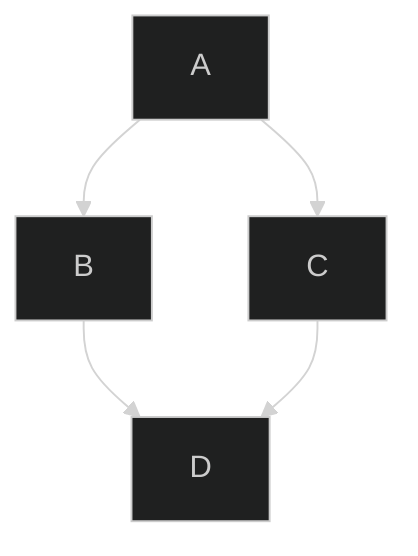

> ❕ TinaCMS now supports **MermaidJS** diagrams in version 2.3.0+

## What is Mermaid?

Mermaid is a diagram definition syntax for Markdown.

> For more details, check the [MermaidJS documentation](https://mermaid.js.org/config/usage.html).

Use this simple graph description language to create flowcharts, sequence diagrams, Gantt charts, and more. Below is a basic example of Mermaid syntax:

````

````


## Mermaid Configuration

You can also pass configuration options directly inside your Mermaid code block to control how diagrams are rendered. For example, you can set the theme to dark mode as shown below:

````

````


## Editing and Previewing Mermaid Diagrams

Once a Mermaid diagram is inserted, you can switch between **Edit Mode** (for modifying the Mermaid code) and **Preview Mode** (to see the rendered diagram).

* **Desktop**: Hover over the diagram to display the edit/preview controls.
* **Mobile**: Click on the diagram to reveal the edit button, then toggle between modes.

### Syntax Error Handling

If there is a syntax error in your Mermaid code, a **red error box** will appear beneath the diagram. This box displays helpful information and errors reported by the Mermaid parser. Correct the syntax, and the diagram will update.


### Deleting Mermaid Diagrams

To delete a Mermaid diagram:

* **Desktop**: Click on the diagram and press `Delete` on your keyboard.
* **While Editing**: Press `Backspace` at the start of the code block.

## Mermaid Package Versioning

TinaCMS uses the **Mermaid NPM package** to render and parse the Mermaid syntax. Currently, we have locked the internal version to `v9.3.0` to ensure compatibility with CommonJS.

However, when installing Mermaid in your own application, you are free to use any version of Mermaid or other compatible rendering packages.

## Examples

### Set up for Mermaid in React

To quickly get started with MermaidJS in your React project, follow these steps:

#### 1. Install the Mermaid Package

First, install the Mermaid package using your package manager:

```shell
pnpm install mermaid
```

#### 2. Create a `MermaidElement` Component

This component will render Mermaid diagrams in your application. Use the following code:

```javascript
import { useRef, useEffect } from 'react';
import mermaid from 'mermaid';

export default function MermaidElement({ value }) {
  const mermaidRef = useRef(null);

  useEffect(() => {
    if (mermaidRef.current) {
      mermaid.initialize({ startOnLoad: true });
      mermaid.run();
    }
  }, []);

  return (
    <div contentEditable={false}>
      <div ref={mermaidRef}>
        <pre className="mermaid">{value}</pre>
      </div>
    </div>
  );
}

```

#### 3. Add the Mermaid Component to `<TinaMarkdown />`

Integrate the `MermaidElement` into the `<TinaMarkdown />` component to handle Mermaid diagrams:

```javascript
<TinaMarkdown content={content} components={{
  mermaid({ value }) {
    return <MermaidElement value={value} />;
  }
}} />

```

#### 4. Done! 🎉

Your React app will now be able to render Mermaid diagrams created in the TinaCMS editor.
